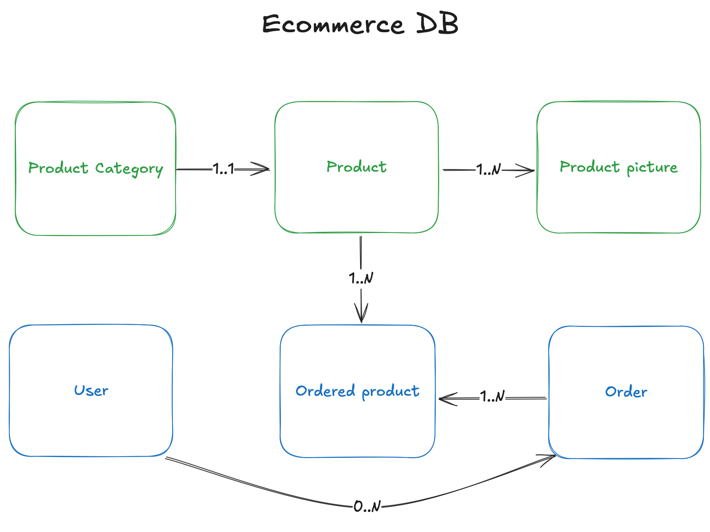

# E-Commerce Application

## Overview

This repository contains the code for a fully responsive e-commerce platform. The application allows users to browse products, filter by category and size, and complete purchases securely. Administrators can manage products and orders through an intuitive admin dashboard. The backend is built using Spring Boot 3, while the frontend uses Angular with Daisy UI backed by Tailwind CSS. The database schema is managed using Liquibase for version-controlled changes.


*(Entity-relationship diagram (ERD) for the e-commerce database.)*

## Features

### User Features
- **Product Browsing**: View featured products, filter by category, size, newest, or oldest.
- **Detailed Product Pages**: Access comprehensive product information and related items.
- **Shopping Cart**: Add/remove items, adjust quantities, and persist cart data across sessions.
- **Secure Checkout**: Authenticate via Kindo SSO and process payments through Stripe.
- **Order Management**: View summaries of past and future orders in the "My Orders" section.

### Admin Features
- **Product Management**: Create, update, and delete products.
- **Category Management**: Organize products into categories.
- **Order Management**: Review and manage customer orders.

## Technology Stack

### Backend
- **Spring Boot 3**: Backend framework for building RESTful APIs.
- **PostgreSQL**: Relational database for storing product and order data.
- **Liquibase**: Database schema management tool.
- **Kindo SSO**: Authentication and authorization service.

### Frontend
- **Angular**: Frontend framework for building a responsive UI.
- **Daisy UI + Tailwind CSS**: Styling libraries for modern, responsive design.

## Setup

### Prerequisites
- Java 21
- Maven
- Node.js (for frontend development)
- Docker (optional, for local development with Docker Compose)

### Backend Setup

#### Build and Run
```bash
# Navigate to the backend directory
cd apps/ecom-backend

# Build the project
mvn clean install

# Run the application
mvn spring-boot:run -Dspring-boot.run.profiles=local
```

### Frontend Setup
```bash
# Navigate to the frontend directory
cd apps/ecom-frontend

# Install dependencies
npm install

# Start the development server
npm start
```

### Docker Compose (Optional)
To set up the PostgreSQL database using Docker Compose:

```bash
# Start the database service
docker-compose up -d
```

## Configuration

### Application Properties
The application configuration is located in `application.yml` and `application-local.yml`. Key settings include:
- **Database Configuration**: Connection details for PostgreSQL.
- **OAuth2 Settings**: Integration with Kinde for authentication.
- **Stripe Configuration**: Payment processing settings.

### Liquibase Changelog
The database schema is managed using Liquibase. The changelog files are located in the `db/changelog` directory. Each change is encapsulated in a `changeSet`, ensuring atomicity and traceability.
